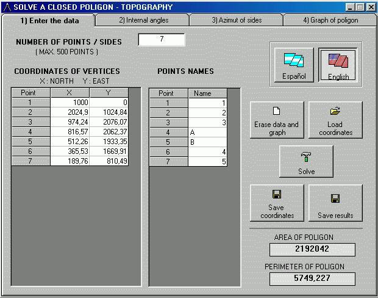

## closed poligon \- TOPOGRAPHY \- poligono cerrado \- topografia

### Description

solves a closed poligon - oriented for topography
 
### More Info
 
coordinates of the vertices

include 2 example files ( easy to write with notepad ) , or enter the values manualy

area , perimeter , graph (zoom , move , save ) , internal angles , azimuth of the sides , lenght of sides

             |
---                |---
**Submitted On**   |2003-04-05 19:00:10
**By**             |[carlos luis](https://github.com/Planet-Source-Code/PSCIndex/blob/master/ByAuthor/carlos-luis.md)
**Level**          |Beginner
**User Rating**    |4.8 (24 globes from 5 users)
**Compatibility**  |VB 6\.0
**Category**       |[Complete Applications](https://github.com/Planet-Source-Code/PSCIndex/blob/master/ByCategory/complete-applications__1-27.md)
**World**          |[Visual Basic](https://github.com/Planet-Source-Code/PSCIndex/blob/master/ByWorld/visual-basic.md)
**Archive File**   |[closed\_pol156981452003\.zip](https://github.com/Planet-Source-Code/carlos-luis-closed-poligon-topography-poligono-cerrado-topografia__1-44449/archive/master.zip)

